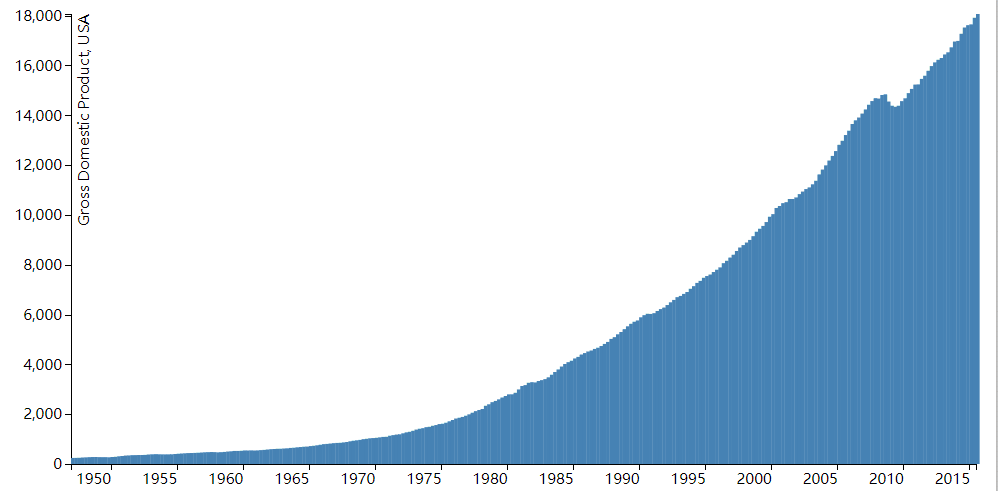
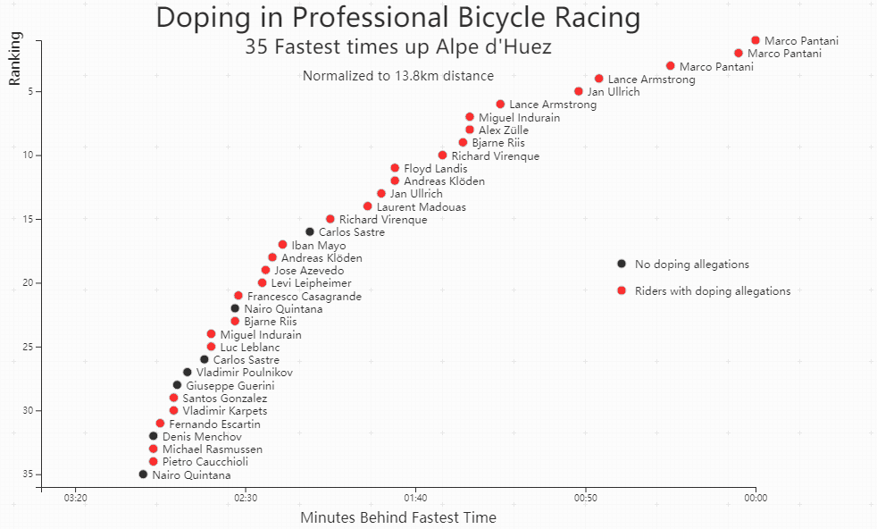
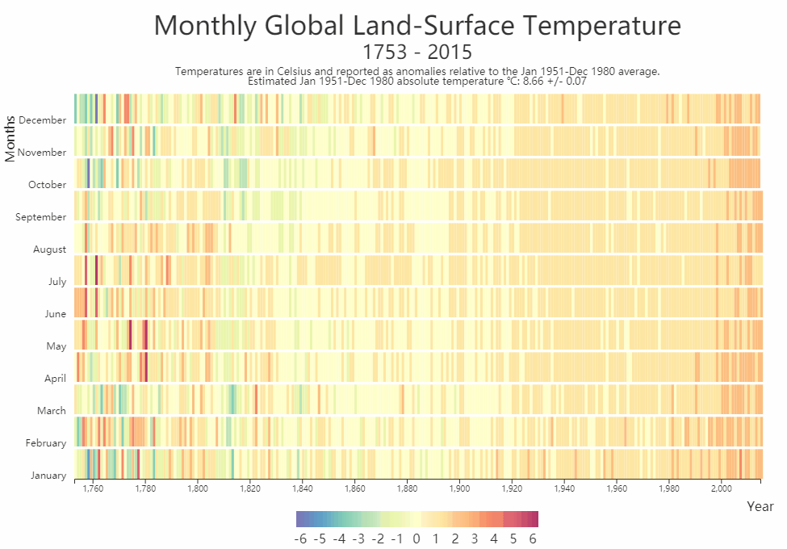

## Data Visualization Projects 

Projects for FreeCodeCampus challenges
* [Bar Chart](https://www.freecodecamp.org/challenges/visualize-data-with-a-bar-chart).
* [Scatterplot](https://www.freecodecamp.org/challenges/visualize-data-with-a-scatterplot-graph)
* [Heat Map](https://www.freecodecamp.org/challenges/visualize-data-with-a-heat-map)

This project was bootstrapped with [Create React App](https://github.com/facebookincubator/create-react-app).

### Examples
* [Home](https://guoxiaoyang.github.io/DataVisualizationProjects/)
* [Bar Chart Demo](https://guoxiaoyang.github.io/DataVisualizationProjects/BarChart)



* [Scatter Demo](https://guoxiaoyang.github.io/DataVisualizationProjects/ScatterPlot)



* [Heat Map Demo]()


## build
```
npm run build
npm run deploy // push to the gh-pages
```
If you want to serve the build in the local, you should put the build files in `build/DataVisualizationProjects/` except the `index.html`.
Then run `serve -s build` and open http://localhost:5000 .


## development
```
npm run start
```
Then open http://localhost:3000
